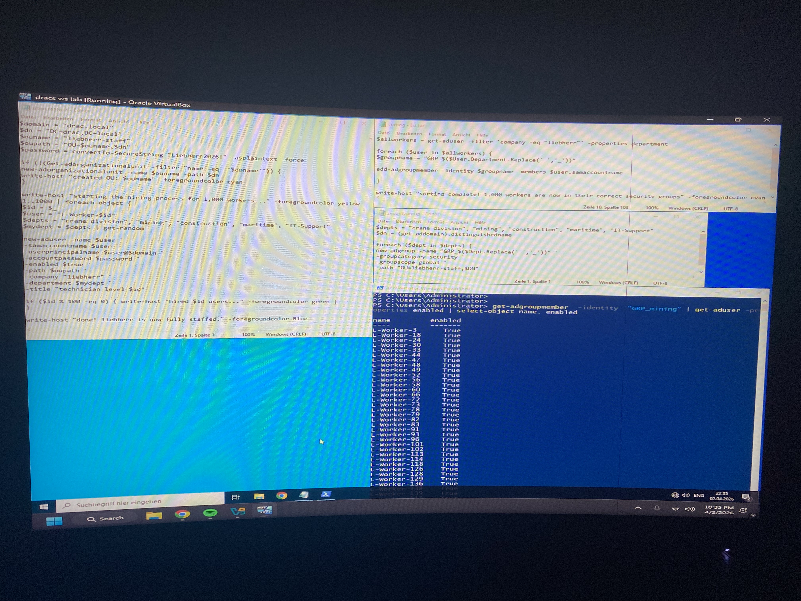
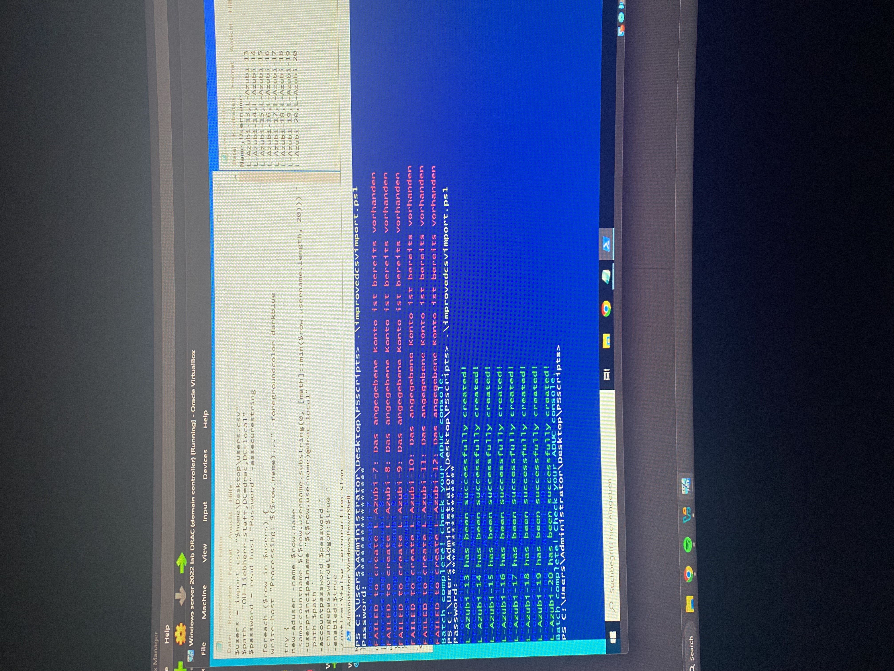
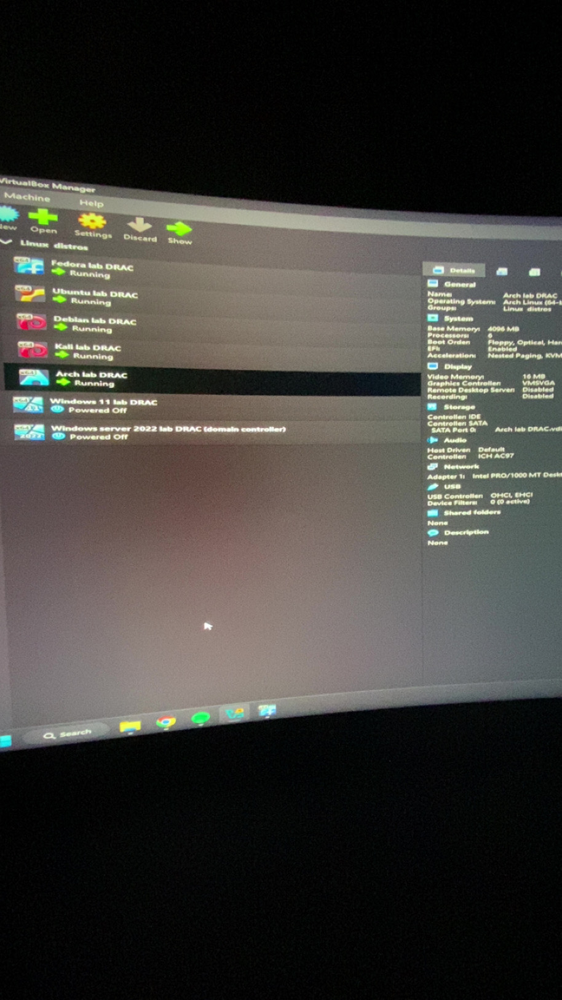
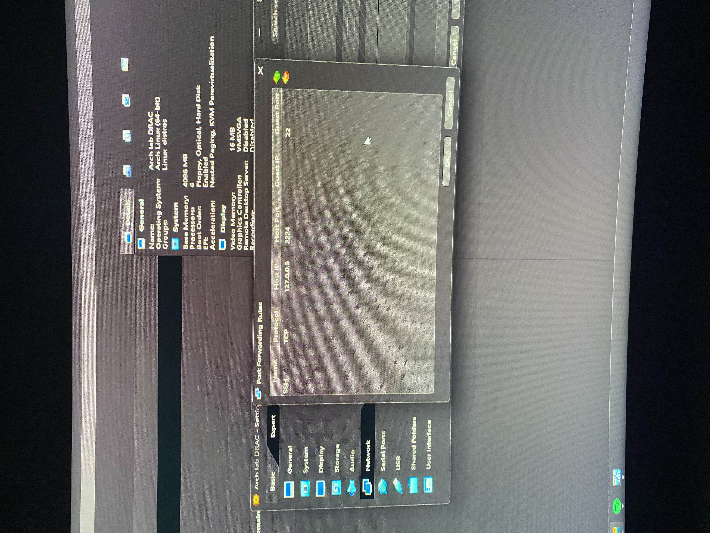

# POC Portfolio

A collection of my automation scripts and virtual lab configurations for Windows Server 2022 and Linux environments.

## Projects

### 1. Security & Management Tools
- **Dracs-IDS (Intrusion Detection System):** A custom-developed network intrusion detection suite designed for robust security monitoring. The application provides real-time traffic analysis, packet monitoring, and a centralized dashboard to track threat levels. Key features include:
    - **Real-Time Monitoring:** Live visualization of packet flow and network activity as demonstrated in "Dracs IDS demo.mp4".
    - **Threat Intelligence:** Automated detection of malicious patterns, including SYN floods and port scanning, with categorized severity alerts (Low to Critical).
    - **Configurable Scanning & Security:** Integrated Nmap support for network scanning, customizable port thresholds, ARP spoofing detection, and blacklisting capabilities.
    - **Alert Management:** Instant notification system for potential policy violations or unauthorized access attempts.

- **Dracs-VmMt (Virtual Machine Management Tool):** A centralized orchestration and tracking tool for virtual lab environments. Features include batch startup of VMs, individual VM control, activity logs, and an integrated lookup dashboard for tracking NAT port forwarding rules, allowing for quick SSH connections without having to manually check hypervisor settings for each lab. Currently supports VirtualBox and VMware.

### 2. Active Directory Automation
- **ActiveDirectory-Mass-Provisioning-Script:** Automated 1,000+ user account creation and OU management.

- **CSV-to-AD-Bulk-Importer:** Robust bulk import tool with `try/catch` error handling for existing accounts.

### 3. Lab Infrastructure & Networking
- **Multi-Distro-VirtualBox-Lab:** Configured virtualized network environments running multiple Linux distributions (Arch, Kali, Debian, Ubuntu, Fedora Server).

- **NAT Port Forwarding Configuration:** Implemented custom NAT port forwarding rules (e.g., mapping Host Port 2224 to Guest Port 22) to allow external SSH connectivity into isolated test environments.

- **Lab Management Tool:** Inventory tracking script for host/guest port mappings.

## Proof of Concept
I have included screenshots verifying my manual type 2 hypervisor configurations, network routing rules, and Active Directory scripting environments.
